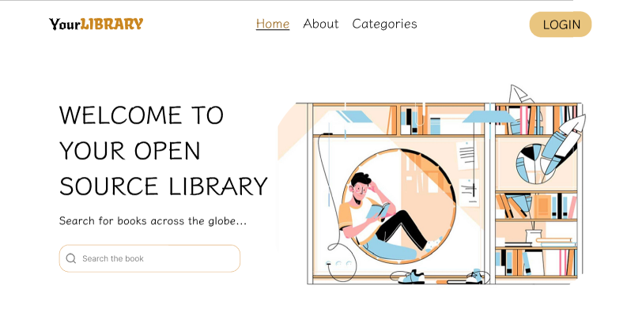
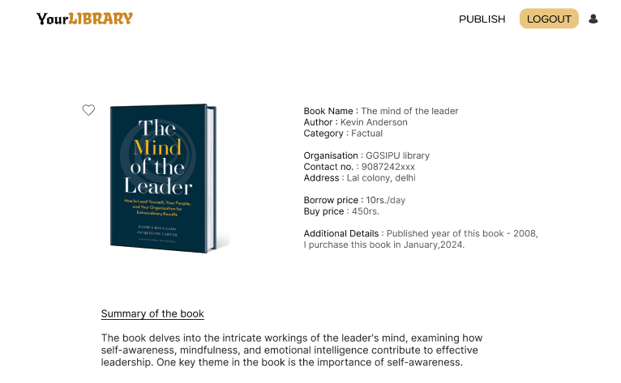

# YourLibrary

YourLibrary is an open-source web application for sharing and discovering books. Built with React, Vite, Tailwind CSS, Redux Toolkit, and Appwrite, it allows users to browse, publish, and manage books in a collaborative environment.

## Features

- User authentication (signup, login, logout)
- Publish and manage books with cover images and details
- Browse books by category (Individual, Institute, etc.)
- Responsive UI with Tailwind CSS
- File upload and storage via Appwrite
- Protected routes for authenticated actions

## Tech Stack

- [React](https://react.dev/)
- [Vite](https://vitejs.dev/)
- [Tailwind CSS](https://tailwindcss.com/)
- [Redux Toolkit](https://redux-toolkit.js.org/)
- [Appwrite](https://appwrite.io/) (backend as a service)
- [React Router](https://reactrouter.com/)

## Screenshots

### Front Page



### Login Page


### Publish Page



## Getting Started

### Prerequisites

- Node.js (v16+ recommended)
- npm

### Installation

1. Clone the repository:
   ```sh
   git clone https://github.com/yourusername/yourlibrary.git
   cd yourlibrary/yrlibrary
   ```

2. Install dependencies:
   ```sh
   npm install
   ```

3. Configure environment variables:

   Edit `.env` with your Appwrite project credentials:
   ```
   VITE_ENDPOINT=your_appwrite_endpoint
   VITE_PROJECT_ID=your_project_id
   VITE_DATABASE_ID=your_database_id
   VITE_COLLECTION_ID=your_collection_id
   VITE_BUCKET_ID=your_bucket_id
   ```

4. Start the development server:
   ```sh
   npm run dev
   ```

5. Open [http://localhost:5173](http://localhost:5173) in your browser.

## Contributing

Contributions are welcome! Please open issues or submit pull requests for improvements and bug fixes.


---

Made with ❤️ for the community
